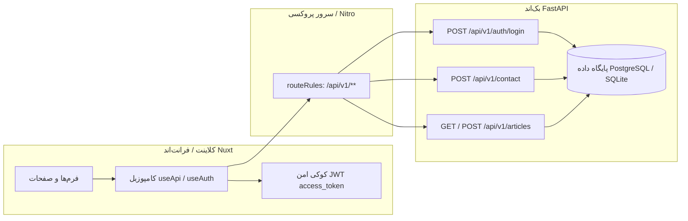

# گزارش جامع ممیزی معماری، عملکرد و کیفیت فرانت‌اند (Frontend Audit Report)

**پروژه:** وب‌سایت و سامانه مدیریت کلینیک روان‌شناسی کاژه
**تاریخ گزارش:** سپتامبر ۲۰۲۶
**نقش:** معمار ارشد فرانت‌اند (Senior Frontend Architect)
**فناوری‌های هسته:** Nuxt 4 (Engine), Vue 3 (Composition API), TypeScript, Tailwind CSS v4, shadcn-vue

---

## ۱. خلاصه اجرایی و نمره سلامت پروژه (Executive Summary & Health Score)

پروژه فرانت‌اند کلینیک روان‌شناسی کاژه با تکیه بر نسخه مدرن **Nuxt 4** و پشته **Tailwind CSS v4 + shadcn-vue** پایه‌گذاری شده است. تمرکز پروژه بر طراحی ملایم و ایمن (Conscious Calm) کاملاً با هویت یک مرکز روان‌شناسی هم‌خوانی دارد. ساختار محتوایی اخیر با تفکیک داده‌ها در پوشه `frontend/app/data/` گام بسیار مثبتی در راستای متمرکزسازی برداشته است. با این حال، پروژه در وضعیت کنونی در مرز میان یک **«پروتوتایپ پیشرفته با داده‌های ماک»** و یک **«اپلیکیشن پروداکشن یکپارچه با سرور»** قرار دارد.

### شاخص‌های سلامت فنی (Health Scores):

| محور ارزیابی                       | امتیاز (از ۱۰) |                   وضعیت                   | توضیح اجمالی                                                                     |
| :--------------------------------- | :------------: | :---------------------------------------: | :------------------------------------------------------------------------------- |
| **معماری و ماژولار بودن**          |    **۷.۰**     |                 🟡 متوسط                  | تفکیک مناسب کامپوننت‌ها؛ اما فقدان لایه سرویس/Composable و میان‌افزار احراز هویت |
| **لایه داده و متمرکزسازی**         |    **۸.۵**     |               🟢 بسیار خوب                | متمرکزسازی موفق در `app/data/`؛ نیازمند رفع هاردکدهای باقی‌مانده در صفحات عمومی  |
| **سیستم تایپ و سازگاری داده**      |    **۶.۰**     |                 🟡 متوسط                  | وجود ۴ تعریف متناقض از مدل مقاله و استفاده از `as any` در صفحات مقالات           |
| **آمادگی اتصال به بک‌اند FastAPI** |    **۴.۰**     |                  🔴 ضعیف                  | فقدان کلاینت HTTP، نبود توکن منیجر، و تکیه فرم‌ها و پنل بر `setTimeout`          |
| **عملکرد، SSR و تایپوگرافی**       |    **۶.۵**     |                 🟡 متوسط                  | عدم لود واقعی فونت وزیرمتن، وجود `@import` گوگل‌فونتز خارجی و ریسک هیدریشن       |
| **سئو و دسترس‌پذیری (SEO/A11y)**   |    **۶.۰**     |                 🟡 متوسط                  | نقص متاتگ‌های OpenGraph/Twitter در اغلب صفحات؛ فقدان `aria-label` در دکمه‌ها     |
| **طراحی بصری و سیستم دیزاین**      |    **۹.۰**     |                  🟢 عالی                  | پیاده‌سازی دقیق روان‌شناسی رنگ‌ها، کامپوننت‌های مدرن و استایل‌های متوازن         |
| **نمره سلامت کل (Overall Score)**  |  **۶.۷ / ۱۰**  | 🟡 **نیازمند بهینه‌سازی قبل از پروداکشن** |

---

## ۲. نقاط قوت کلیدی پروژه (Core Strengths)

1. **انطباق سیستم دیزاین با هویت برند (Conscious Calm Psychology Design System):**
   - استفاده حرفه‌ای از توکن‌های رنگی آرامش‌بخش (سبز تیره گیاهی `--primary: #16484a`، رنگ‌های پشتیبان مریم‌گلی `sage` و تاکید گرم ملایم `--cta: #dda075`).
   - کنترل سایه‌ها و گوشه‌های گرد متناسب (`--radius: 0.875rem` تا کپسولی `rounded-pill`) که استرس بصری مراجع را به حداقل می‌رساند.
2. **پیشرفت چشمگیر در متمرکزسازی داده‌ها (`Single Source of Truth` در پنل ادمین):**
   - تمامی صفحات و کامپوننت‌های پنل مدیریت (`pages/admin/**` و `components/admin/**`) از رشته‌های متنی، آرایه‌ها و آبجکت‌های محلی پاکسازی شده و به داده‌های متمرکز در [admin.ts](file:///home/omidreza/Work/Clients/kazheh/frontend/app/data/admin.ts) و [adminMock.ts](file:///home/omidreza/Work/Clients/kazheh/frontend/app/data/adminMock.ts) متصل شده‌اند.
3. **بهره‌گیری از زیرساخت‌های دسترس‌پذیر shadcn-vue و Reka UI:**
   - استفاده از کامپوننت‌های استاندارد برای دیالوگ‌ها، سایدبار موبایل (`Sheet`)، آکاردئون پرسش‌ها و اعلانات پیام (`Sonner`).
4. **بیلد موفق و مدرن با Nuxt 4 و Bun:**
   - خروجی بیلد پروداکشن با موتور Nitro و کامپایلر Vite بدون هیچ خطای سینتکسی یا کامپایل با موفقیت ایجاد می‌شود.
5. **ساختار پیش‌فرض راست‌به‌چپ (RTL-First):**
   - پیکربندی ویژگی‌های روت HTML با `dir="rtl"` و `lang="fa"`.

---

## ۳. انتقادات، نقاط ضعف و چالش‌های فنی (Critical Issues & Weaknesses)

### ۳.۱. معماری و تفکیک وظایف (Architecture & Modularization)

#### ۱. فقدان لایه Composable و سرویس‌های ارتباطی (No API Service Layer)

- **موقعیت:** کل پروژه (عدم وجود پوشه `frontend/app/composables/`)
- **شرح مشکل:** در کل فرانت‌اند، هیچ تابعی مانند `useApi`, `useAuth`, `useArticles` یا کلاینت `$fetch` سفارشی برای اتصال به سرور پیاده‌سازی نشده است.
- **پیامد:** تمام فرم‌ها از جمله [ContactForm.vue](file:///home/omidreza/Work/Clients/kazheh/frontend/app/components/contact/ContactForm.vue#L45)، فرم ورود [login.vue](file:///home/omidreza/Work/Clients/kazheh/frontend/app/pages/admin/login.vue#L24) و عملیات پنل ادمین با `setTimeout` رفتار سرور را شبیه‌سازی می‌کنند. اتصال به بک‌اند بدون ایجاد این لایه به بازنویسی پراکنده صفحات منجر خواهد شد.

#### ۲. فقدان گارد مسیر و میان‌افزار احراز هویت (Missing Route Guard Middleware)

- **موقعیت:** عدم وجود پوشه `frontend/app/middleware/`
- **شرح مشکل:** مسیرهای پنل مدیریت (`/admin`, `/admin/messages`, `/admin/articles`, `/admin/profile`) هیچ محافظتی ندارند. هر کاربری با وارد کردن مستقیم آدرس URL می‌تواند به پنل مدیریت دسترسی یابد و هیچ کوکی یا توکن اعتبارسنجی‌ای بررسی نمی‌شود.

#### ۳. عدم استفاده از لایه‌بندی اختصاصی لاگین (`auth.vue` بلااستفاده مانده است)

- **موقعیت:** [layouts/auth.vue](file:///home/omidreza/Work/Clients/kazheh/frontend/app/layouts/auth.vue) در مقابل [pages/admin/login.vue](file:///home/omidreza/Work/Clients/kazheh/frontend/app/pages/admin/login.vue)
- **شرح مشکل:** لایه‌ای تمیز و ایزوله برای ورود در `layouts/auth.vue` طراحی شده است، اما صفحه `login.vue` فاقد دستور `definePageMeta({ layout: 'auth' })` است. در نتیجه، صفحه ورود ادمین با لایه پیش‌فرض سایت (`layouts/default.vue`) همراه با هدر و فوتر عمومی سایت بارگذاری می‌شود!

#### ۴. دوگانگی و تناقض معماری مقالات (Nuxt Content در برابر دیتابیس FastAPI)

- **موقعیت:**
  - بخش عمومی: [pages/index.vue](file:///home/omidreza/Work/Clients/kazheh/frontend/app/pages/index.vue), [pages/articles/index.vue](file:///home/omidreza/Work/Clients/kazheh/frontend/app/pages/articles/index.vue), [pages/articles/[slug].vue](file:///home/omidreza/Work/Clients/kazheh/frontend/app/pages/articles/%5Bslug%5D.vue)
  - بخش ادمین: [pages/admin/articles/\*\*](file:///home/omidreza/Work/Clients/kazheh/frontend/app/pages/admin/articles)
  - بک‌اند: `backend/app/api/v1/endpoints/articles.py`
- **شرح مشکل:** صفحات عمومی وب‌سایت در حال حاضر با استفاده از `queryCollection('articles')` ماژول `@nuxt/content` فایل‌های استاتیک مارک‌داون موجود در `frontend/content/articles/` را می‌خوانند. در عین حال، پنل ادمین و بک‌اند FastAPI سیستم ذخیره‌سازی مقالات در پایگاه‌داده (با امکان بارگذاری تصویر، اسلاگ، پیش‌نویس و ...) را در نظر دارند. این معماری دوشاخه بوده و تغییر در ادمین هیچ اثری بر مقالات عمومی نخواهد گذاشت.

---

### ۳.۲. سیستم داده و تایپ‌اسکریپت (Data Layer & Type Safety)

#### ۱. چنددستگی و ناسازگاری تعاریف مدل مقاله (Article Type Fragmentation)

در بخش‌های مختلف، ۴ مدل متفاوت با نام‌گذاری‌های نامتقارن برای مقاله تعریف شده است:

1. `PublicArticleItem` در [PublicArticleCard.vue](file:///home/omidreza/Work/Clients/kazheh/frontend/app/components/articles/PublicArticleCard.vue#L4): فیلدهای `path`, `readingTime`, `cover`.
2. `Article` محلی در [ArticlesSection.vue](file:///home/omidreza/Work/Clients/kazheh/frontend/app/components/home/ArticlesSection.vue#L5): فیلدهای `href`, `readingMinutes`, `image: { src, alt }`.
3. `AdminArticleItem` در [adminMock.ts](file:///home/omidreza/Work/Clients/kazheh/frontend/app/data/adminMock.ts#L10): فیلدهای `slug`, `summary`, `is_published`, `created_at`.
4. `ArticleListItem` در بک‌اند FastAPI (`backend/app/schemas/article.py`): فیلدهای `id`, `title`, `slug`, `summary`, `cover_image_url`, `is_published`, `author_id`, `created_at`, `updated_at`.

- **نتیجه:** این تضاد در فیلدها (`href` در برابر `path`، `readingTime` در برابر `readingMinutes`، `cover` در برابر `cover_image_url`) اتصال داده‌ها را مستعد باگ و تبدیل‌های تکراری داده (Data Mapping) می‌کند.

#### ۲. نشت `as any` و دور زدن تایپ‌سیفتی

- **موقعیت:**
  - [pages/index.vue:19-24](file:///home/omidreza/Work/Clients/kazheh/frontend/app/pages/index.vue#L19-L24): `(queryCollection('articles') as any).order(...).all()` و `list.map((item: any) => ...)`
  - [pages/articles/index.vue:17-18](file:///home/omidreza/Work/Clients/kazheh/frontend/app/pages/articles/index.vue#L17-L18): `(queryCollection('articles') as any).all()`
  - [pages/articles/[slug].vue:58-75](file:///home/omidreza/Work/Clients/kazheh/frontend/app/pages/articles/%5Bslug%5D.vue#L58-L75): استفاده از `(article as any).category`, `(article as any).readingTime`, `(article as any).cover`.
- **شرح مشکل:** کامپوننت‌های رندرینگ بدون تعریف اینترفیس سخت‌گیرانه تایپ‌اسکریپت به ویژگی‌های داینامیک متکی هستند.

#### ۳. عدم استفاده از کتابخانه‌های اعتبارسنجی نصب‌شده (Zod / Vee-Validate)

- در [package.json](file:///home/omidreza/Work/Clients/kazheh/frontend/package.json#L15-L30) بسته‌های `@vee-validate/zod`, `vee-validate` و `zod` نصب هستند، اما در [ContactForm.vue](file:///home/omidreza/Work/Clients/kazheh/frontend/app/components/contact/ContactForm.vue#L23-L41) و فرم لاگین، اعتبارسنجی‌ها به روش دستی و با `RegExp` معمولی و `if`های شکننده انجام شده است.

#### ۴. باقی ماندن داده‌های هاردکدشده در صفحات و کامپوننت‌های عمومی

- در [pages/services.vue:20-36](file:///home/omidreza/Work/Clients/kazheh/frontend/app/pages/services.vue#L20-L36): آرایه `principles` (اصول ۳گانه ارائه خدمات) مستقیماً درون صفحه نوشته شده و در فایل داده قرار ندارد.
- در [pages/services.vue:76-106](file:///home/omidreza/Work/Clients/kazheh/frontend/app/pages/services.vue#L76-L106): عناوین بخش CTA پایانی صفحه هاردکد هستند.
- در [components/contact/ContactForm.vue:66-109](file:///home/omidreza/Work/Clients/kazheh/frontend/app/components/contact/ContactForm.vue#L66-L109): تمامی برچسب‌ها، متن دکمه، متون پیام خطا و پیام محرمانگی در تمپلیت هاردکد هستند.
- در [error.vue:56](file:///home/omidreza/Work/Clients/kazheh/frontend/app/error.vue#L56): نام اشتباه **«کلینیک آرامش»** به جای «کاژه» به عنوان پیش‌عنوان خطای ۴۰۴/۵۰۰ هاردکد شده است!

---

### ۳.۳. عملکرد، رندرینگ و سئو (Performance, SSR & SEO)

#### ۱. چالش لودینگ و عدم وجود فونت فارسی «وزیرمتن» (Font Delivery Issue)

- **موقعیت:** [assets/css/tailwind.css:1](file:///home/omidreza/Work/Clients/kazheh/frontend/app/assets/css/tailwind.css#L1) و خط ۱۵۵
- **شرح مشکل:** در خط اول CSS دستور زیر درج شده است:
  ```css
  @import url('https://fonts.googleapis.com/css2?family=Inter:wght@400;500;600;700&display=swap');
  ```
  در حالی که متغیر اصلی فونت `--font-sans: 'Vazirmatn', Tahoma, sans-serif;` تنظیم شده است. فونت `Inter` انگلیسی است و مانع رندرینگ سریع (Render-blocking) می‌شود. از طرف دیگر، **هیچ فایل فونت وزیرمتنی** در پروژه (نه به صورت Self-hosted در `public/fonts/` و نه از CDN) ایمپورت نشده است!
- **پیامد:** برای تمامی کاربرانی که فونت وزیرمتن را روی دستگاه خود نصب ندارند، فونت به صورت Tahoma نمایش داده می‌شود و زیبایی تایپوگرافی از بین می‌رود. همچنین وابستگی به سرورهای گوگل در شبکه ایران خطر اختلال در بارگذاری صفحه را افزایش می‌دهد.

#### ۲. قوانین تهاجمی `!important` در استایل‌های سراسری

- **موقعیت:** [assets/css/tailwind.css:331-349](file:///home/omidreza/Work/Clients/kazheh/frontend/app/assets/css/tailwind.css#L331-L349)
- **شرح مشکل:** استایل‌های زیر به صورت سراسری تحمیل شده‌اند:
  ```css
  html,
  body,
  #__nuxt {
    direction: rtl !important;
    text-align: right !important;
  }
  .justify-between {
    direction: rtl !important;
  }
  .flex-1 {
    text-align: right !important;
  }
  ```
  این کار معماری CSS را شکننده کرده و کامپوننت‌هایی که نیاز به نمایش LTR دارند (نظیر فیلدهای شماره تماس، نام کاربری انگلیسی، اسلاگ‌ها و کدهای دسترسی) را وادار به افزودن استایل‌های اینلاین `dir="ltr"` می‌کند. علاوه بر این، بلاک `@layer base` دو بار در فایل `tailwind.css` تکرار شده است.

#### ۳. فقدان بهینه‌سازی تصاویر (No Nuxt Image / Optimization)

- در هیچ کجای فرانت‌اند از ماژول استاندارد `@nuxt/image` استفاده نشده است.
- تصاویر با تگ معمولی `` لود می‌شوند و قابلیت‌های حیاتی مانند تبدیل به فرمت‌های سبک‌تر، ابعاد واکنش‌گرا بر اساس اندازه نمایشگر (`srcset`) و جلوگیری از تغییر ناگهانی چیدمان (Cumulative Layout Shift - CLS) به صورت سیستمی فعال نیستند.

#### ۴. خطرات ناسازگاری هیدریشن (Hydration Mismatch Risks)

- در [AppFooter.vue:15](file:///home/omidreza/Work/Clients/kazheh/frontend/app/components/layouts/AppFooter.vue#L15) و [auth.vue:42](file:///home/omidreza/Work/Clients/kazheh/frontend/app/layouts/auth.vue#L42): عبارت `new Date().getFullYear()` مستقیماً رندر می‌شود. اگر زمان سرور بر اساس سال میلادی باشد و کاربر تقویم دیگری داشته باشد یا در لحظه تحویل سال، هیدریشن مرورگر ممکن است دچار عدم تطابق شود.
- توابع `formatDate` و `formatNumber` مبتنی بر `new Intl.DateTimeFormat('fa-IR')` در ۵ کامپوننت مختلف کپی شده‌اند. موتورهای مختلف جاوااسکریپت در سمت کلاینت و سرور (Node/Bun در برابر مرورگرهای قدیمی) خروجی‌های متفاوتی در ارقام فارسی تولید می‌کنند که می‌تواند به خطای Hydration در کنسول منجر شود.

#### ۵. وضعیت سئو و متاتگ‌ها (SEO & Meta Tags)

- اکثر صفحات اصلی از جمله [index.vue](file:///home/omidreza/Work/Clients/kazheh/frontend/app/pages/index.vue), [about.vue](file:///home/omidreza/Work/Clients/kazheh/frontend/app/pages/about.vue), [contact.vue](file:///home/omidreza/Work/Clients/kazheh/frontend/app/pages/contact.vue) و [privacy.vue](file:///home/omidreza/Work/Clients/kazheh/frontend/app/pages/privacy.vue) صرفاً دارای `title` و یک `description` ساده هستند.
- متاتگ‌های حیاتی شبکه‌های اجتماعی نظیر `og:title`, `og:description`, `og:image`, `og:url`, `twitter:card`, `twitter:image` و پیوند استاندارد صفحه (`rel="canonical"`) غایب هستند.
- در پروژه از متد تایپ‌سیف و مدرن `useSeoMeta()` استفاده نشده و متاتگ‌ها با متد سنتی `useHead` نوشته شده‌اند.

---

### ۳.۴. تجربه کاربری و دسترس‌پذیری (UX/UI & Accessibility)

1. **دکمه‌های فاقد برچسب برای صفحه‌خوان‌ها (Missing Icon-Only Button Labels):**
   - در [ArticleCard.vue:81](file:///home/omidreza/Work/Clients/kazheh/frontend/app/components/admin/articles/ArticleCard.vue#L81) و [MessageCard.vue:82](file:///home/omidreza/Work/Clients/kazheh/frontend/app/components/admin/messages/MessageCard.vue#L82) و [layouts/admin.vue:179](file:///home/omidreza/Work/Clients/kazheh/frontend/app/layouts/admin.vue#L179)، دکمه‌های آیکونی حذف و اعلان‌ها فاقد `aria-label` هستند.
2. **نشت فوکوس در بخش‌های غیرفعال (Accessibility Leak):**
   - در [UserPreviewList.vue](file:///home/omidreza/Work/Clients/kazheh/frontend/app/components/admin/users/UserPreviewList.vue#L22)، بخش پیش‌نمایش پرسنل با بلور و `pointer-events-none` غیرفعال شده است، اما شناسه `aria-hidden="true"` ندارد؛ در نتیجه صفحه‌خوان‌ها المان‌های تستی این بخش را می‌خوانند که موجب سردرگمی کاربران دارای معلولیت می‌شود.
3. **محدودیت آیکون‌های شبکه‌های اجتماعی در فوتر:**
   - در [AppFooter.vue:63](file:///home/omidreza/Work/Clients/kazheh/frontend/app/components/layouts/AppFooter.vue#L63) کامپوننت فقط شرط `<Camera v-if="social.icon === 'camera'" />` را پشتیبانی می‌کند. اگر کانال تلگرام، پیوند بله، ایتا یا لینکدین به سایت افزوده شود، آیکون آن رندر نخواهد شد.

---

## ۴. چک‌لیست اقدامات پیشنهادی با اولویت‌بندی (Actionable Recommendations)

### ۴.۱. اولویت بالا (High Priority - قبل از استقرار پروداکشن)

- [ ] **۱. ایجاد لایه مدیریت کلاینت و توکن احراز هویت:**
  - ساخت کامپوزبل `frontend/app/composables/useApi.ts` با استفاده از `$fetch.create` یا `useFetch` که توکن دسترسی را به طور خودکار از کوکی امن (`useCookie('access_token')`) خوانده و در هدر `Authorization: Bearer <token>` قرار دهد.
  - هدایت خطای `401 Unauthorized` به صفحه `/admin/login` و پاک‌سازی استیت.
- [ ] **۲. ایجاد میان‌افزار گارد امنیتی ادمین (`middleware/auth.ts`):**
  - ایجاد فایل میان‌افزار و فراخوانی آن در `frontend/app/layouts/admin.vue` یا به صورت سراسری برای مسیرهای `/admin/**` به جز `/admin/login`.
- [ ] **۳. اتصال لایه `layouts/auth.vue` به صفحه ورود:**
  - افزودن `definePageMeta({ layout: 'auth' })` به `frontend/app/pages/admin/login.vue`.
- [ ] **۴. میزبانی محلی فونت فارسی وزیرمتن (Self-host Vazirmatn):**
  - دانلود فونت استاندارد `Vazirmatn-UI-RD` (دارای ارقام فارسی) و قرار دادن فرمت‌های `woff2` در `frontend/app/assets/fonts/` یا `public/fonts/`.
  - تعریف `@font-face` در ابتدای `tailwind.css` و حذف `@import` فونت خارجی `Inter`.
- [ ] **۵. رفع نام نادرست و متن‌های هاردکد در `error.vue` و `services.vue`:**
  - جایگزینی «کلینیک آرامش» در [error.vue](file:///home/omidreza/Work/Clients/kazheh/frontend/app/error.vue) با `siteConfig.name` و انتقال آرایه `principles` در [services.vue](file:///home/omidreza/Work/Clients/kazheh/frontend/app/pages/services.vue) به `frontend/app/data/services.ts`.
- [ ] **۶. تصمیم‌گیری قطعی درباره معماری مقالات:**
  - در صورت استفاده از پایگاه‌داده FastAPI، کدهای `queryCollection` در بخش عمومی حذف شده و اندپوینت‌های `GET /api/v1/articles` متصل شوند.

---

### ۴.۲. اولویت متوسط (Medium Priority - ارتقای کیفیت و پایداری)

- [ ] **۷. ارتقای متاتگ‌های سئو با `useSeoMeta`:**
  - تبدیل متاتگ‌های تمامی صفحات اصلی و مقالات به متد تایپ‌سیف `useSeoMeta()` شامل:
    `title`, `description`, `ogTitle`, `ogDescription`, `ogImage`, `ogType`, `ogLocale: 'fa_IR'`, `twitterCard: 'summary_large_image'`.
- [ ] **۸. فعال‌سازی اعتبارسنجی فرم‌ها با Zod و Vee-Validate:**
  - اتصال فرم تماس مراجع در [ContactForm.vue](file:///home/omidreza/Work/Clients/kazheh/frontend/app/components/contact/ContactForm.vue) و ورود در [login.vue](file:///home/omidreza/Work/Clients/kazheh/frontend/app/pages/admin/login.vue) به اسکیماهای Zod.
- [ ] **۹. پاکسازی قوانین تهاجمی `!important` در `tailwind.css`:**
  - ادغام دو بلاک `@layer base`، حذف `!important` از کلاس‌های کاربردی `.justify-between` و `.flex-1`.
- [ ] **۱۰. تجمیع توابع تاریخ و اعداد فارسی در `lib/utils.ts`:**
  - متمرکزسازی توابع `formatDate` و `formatNumber` در یک ماژول واحد با تست هیدریشن ایمن.
- [ ] **۱۱. نصب و فعال‌سازی ماژول بهینه‌سازی تصاویر (`@nuxt/image`):**
  - تنظیم ارائه‌دهنده (Provider) برای پشتیبانی از تصاویر مقالات آپلودشده در مسیر `/static/articles/`.

---

### ۴.۳. اولویت تکمیلی (Low Priority - تمیزکاری و جزئیات UX)

- [ ] **۱۲. افزودن `aria-label` به دکمه‌های آیکونی:**
  - تامین متن‌های جایگزین برای دکمه‌های حذف، ویرایش و مشاهده در کامپوننت‌های پنل مدیریت.
- [ ] **۱۳. تکمیل آیکون‌های داینامیک شبکه‌های اجتماعی در فوتر:**
  - پشتیبانی از آیکون‌های تلگرام، اینستاگرام، واتس‌اپ و شبکه‌های داخلی در [AppFooter.vue](file:///home/omidreza/Work/Clients/kazheh/frontend/app/components/layouts/AppFooter.vue).
- [ ] **۱۴. پیاده‌سازی اسکلتون‌های لودینگ واقعی (Skeleton Loaders):**
  - جایگزینی وضعیت بارگذاری ساده با کامپوننت‌های اسکلتون shadcn در جداول پیام‌ها و کارت‌های مقالات.

---

## ۵. نقشه راه پیش‌نیازها قبل از اتصال به بک‌اند FastAPI (Pre-integration Checklist)

جهت برقراری ارتباط بدون نقص میان فرانت‌اند Nuxt و بک‌اند FastAPI، پیش‌نیازهای زیر باید به دقت رعایت و پیاده‌سازی شوند:



### ۵.۱. ماتریس تطبیق اندپوینت‌های سرور با کامپوننت‌های فرانت‌اند

| بخش فرانت‌اند                                      | اندپوینت FastAPI                | متد HTTP | ساختار ورودی (Request)                                             | ساختار خروجی (Response)                          |
| :------------------------------------------------- | :------------------------------ | :------: | :----------------------------------------------------------------- | :----------------------------------------------- |
| **ورود مدیر** (`admin/login.vue`)                  | `/api/v1/auth/login`            |  `POST`  | `{ phone: string, password: string }`                              | `{ access_token: string, token_type: "bearer" }` |
| **اطلاعات نشست مدیر** (`layouts/admin.vue`)        | `/api/v1/auth/me`               |  `GET`   | هدر `Authorization: Bearer ...`                                    | `AdminUserResponse`                              |
| **ارسال پیام مراجع** (`ContactForm.vue`)           | `/api/v1/contact`               |  `POST`  | `{ full_name, phone, email, subject, message }`                    | `ContactMessageResponse`                         |
| **لیست پیام‌ها در ادمین** (`messages/index.vue`)   | `/api/v1/contact`               |  `GET`   | فیلترها و صفحه‌بندی اختیاری                                        | `List[ContactMessageResponse]`                   |
| **تغییر وضعیت پیام** (`messages/[id].vue`)         | `/api/v1/contact/{id}`          | `PATCH`  | `{ is_read: boolean }`                                             | `ContactMessageResponse`                         |
| **حذف پیام مراجع** (`shared/DeleteConfirmDialog`)  | `/api/v1/contact/{id}`          | `DELETE` | شناسه `id`                                                         | وضعیت `204 No Content`                           |
| **لیست مقالات عمومی** (`articles/index.vue`)       | `/api/v1/articles`              |  `GET`   | پارامترهای صفحه‌بندی و وضعیت انتشار                                | `List[ArticleListItem]`                          |
| **مشاهده مقاله کامل** (`articles/[slug].vue`)      | `/api/v1/articles/{slug}`       |  `GET`   | نامک یا شناسه مقاله                                                | `ArticleResponse`                                |
| **ایجاد مقاله جدید** (`articles/create.vue`)       | `/api/v1/articles`              |  `POST`  | `{ title, slug, summary, content, is_published, cover_image_url }` | `ArticleResponse`                                |
| **آپلود تصویر مقاله** (`articles/ArticleForm.vue`) | `/api/v1/articles/upload-image` |  `POST`  | فرم چندبخشی فایل (`multipart/form-data`)                           | `{ image_url: string }`                          |

### ۵.۲. مدیریت احراز هویت و ذخیره توکن (JWT Storage Strategy)

1. **عدم استفاده از `localStorage` برای توکن:**
   در اپلیکیشن‌های SSR مانند Nuxt، سرور به `localStorage` مرورگر دسترسی ندارد و خواندن توکن در زمان SSR ناممکن خواهد بود؛ همچنین `localStorage` در برابر حملات XSS آسیب‌پذیر است.
2. **استفاده از `useCookie('kazheh_token')`:**
   کوکی با فلگ‌های `sameSite: 'lax'`, `secure: process.env.NODE_ENV === 'production'` تنظیم شود تا هم سرور Nitro در رندر اول و هم کلاینت در درخواست‌های بعدی به آن دسترسی داشته باشند.

### ۵.۳. مدیریت خطاهای اعتبارسنجی سرور (Pydantic 422 Translation)

بک‌اند FastAPI خطاهای اعتبارسنجی را به فرمت استاندارد Pydantic برمی‌گرداند:

```json
{
  "detail": [
    {
      "loc": ["body", "phone"],
      "msg": "value is not a valid phone number",
      "type": "value_error"
    }
  ]
}
```

کامپوزبل ارتباطی فرانت‌اند (`useApi`) باید یک مترجم خطا داشته باشد که خطاهای با کد ۴۲۲ را باز کرده و مستقیماً روی فیلدهای متناظر در فرم نمایش دهد.

### ۵.۴. پیکربندی Reverse Proxy در Nitro

در فایل `nuxt.config.ts`، همانند قانون موجود برای `/static/**`، برای درخواست‌های API نیز یک پروکسی تعریف شود تا نیازی به درگیر شدن با مشکلات CORS در محیط توسعه و تست نباشد:

```typescript
nitro: {
  routeRules: {
    '/api/**': {
      proxy: (process.env.NUXT_PUBLIC_API_URL || 'http://127.0.0.1:8000/api/v1') + '/**',
    },
    '/static/**': {
      proxy: (process.env.NUXT_PUBLIC_API_URL || 'http://127.0.0.1:8000').replace(/\/api\/v1\/?$/, '') + '/static/**',
    },
  },
}
```

---

## ۶. نتیجه‌گیری ممیزی (Audit Conclusion)

فرانت‌اند کلینیک روان‌شناسی کاژه از دیدگاه تجربه کاربری، هارمونی بصری، کامپوننت‌های مدرن و سازمان‌دهی استاتیک در سطح بسیار مقبولی قرار دارد. پایه‌گذاری متمرکز لایه داده در `app/data/` مزیت بزرگی برای تیم توسعه فراهم کرده است.
تمرکز فاز آتی توسعه باید بر **حذف دوشاخگی مقالات (انتخاب قطعی بین API یا Nuxt Content)**، **تکمیل لایه کلاینت API و میان‌افزار گارد مسیر** و **حل مسئله تحویل فونت فارسی وزیرمتن** قرار گیرد تا فرانت‌اند به معنای واقعی کلمه آماده استقرار پروداکشن (Production-Ready) گردد.
